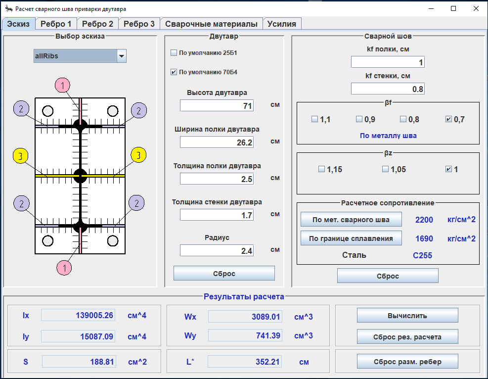
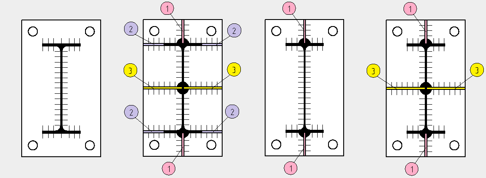
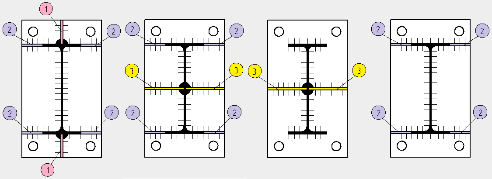

## Pro.Engineer.Java.CalculationWelds.IBeam

### Настольное приложение для проверки сварных швов приварки двутавра.

#### Цель разработки: проверка сварного соединения на соответствие п. 14.1.16, 14.1.17, 14.1.18
#### СП 16.13330.2017.

#### В приложении использована архитектура с разделенной моделью (separable model architecture)
#### или отношение модель-представитель (model-delegate).

***В приложении предусмотрены следующие расположения ребер:***

#### N.B. Приложение в стадии разработки. Планируются изменения.

(<a href="#readme-top">back to top</a>)
