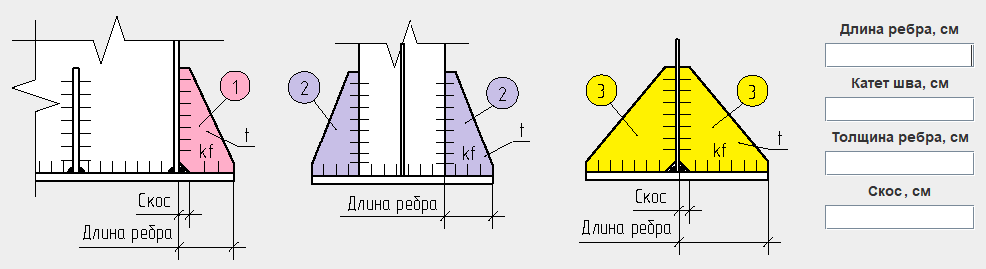

## Pro.Engineer.Java.CalculationWelds.IBeam

### Настольное приложение для проверки сварных швов приварки двутавра.

#### Цель разработки: проверка сварного соединения на соответствие п. 14.1.16, 14.1.17, 14.1.18 СП 16.13330.2017.

#### В приложении использована архитектура с разделенной моделью (separable model architecture)
#### или отношение модель-представитель (model-delegate).

* В приложении предусмотрены следующие расположения ребер:

* Предусмотрена возможность задания разных катетов сварных швов приварки стенки и полки двутавра. 

* При расчете характеристик сварных швов учитываются геометрические размеры каждого ребра.

* Предусмотрен выбор расчетного сопротивления Rwf угловых швов срезу (условному) по металлу шва из таблицы:

* Предусмотрен выбор расчетного сопротивления Rwz угловых швов срезу (условному) по металлу границы сплавления из таблицы:

* Согласно п. 14.1.16 СП 16.13330.2017, из длины каждого непрерывного участка сварного шва вычитается 1 см.

* Приложение позволяет произвести расчет сварных швов на действие N, Qx, Qy, Mx, My

* Реализована проверка применяемых сварочных материалов на условия п. 14.1.8 СП 16.13330.2017.

* Предусмотрена возможность создания txt файла с результатами расчета.

#### N.B. Приложение в стадии разработки. Планируются изменения.

(<a href="#readme-top">back to top</a>)
